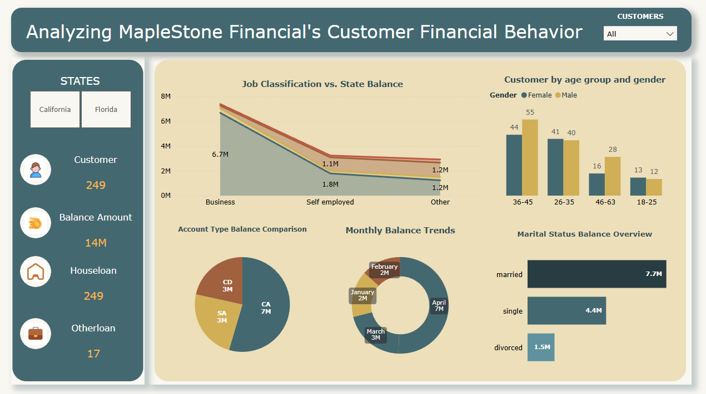

# Banking Customer Analysis

## Project Overview

### Dataset Description

The MapleStone Financial Customers Banking Details dataset contains information on customers' banking details, including their customer ID, Customer name, gender, age, country, state, job classification, marital status, account type, date joined, amount balance, house loan, and other loan details. The dataset is focused on the banking and financial activities of MapleStone Financial customers.

### Objectives (Business problem):	
* Analyze the age distribution of MapleStone Financial Banking customers and identify the most common age group.
* Compare the average balance in the accounts of male and female customers to determine if there is a gender-based disparity in account balances.
* Identify the top three states with the highest number of MapleStone Financial banking customers and determine the percentage of total customers they constitute.
* Analyze the correlation between the type of job classification and the presence of housing and other loans among MapleStone Financial Banking customers.
* Determine the percentage of married customers with housing loans and compare it to the percentage of unmarried customers with housing loans to identify any significant differences.
* Identify the most common account type among MapleStone Financial banking customers and determine the percentage of total customers with this account type.
* Analyze the relationship between the length of time a customer has been with MapleStone Financial and their account balance to determine if there is a correlation between the two variables.
* Identify the top three countries with the highest number of MapleStone Financial Banking customers and determine the percentage of total customers they constitute.

### Data Preparation (Data Cleaning in Power Query):

* Changed data types for each column using the Change Type option.
* Recreated the Name column by capitalizing each word.
* Merged the Name and Sir Name columns into a single column with a space separator.
* Removed duplicate values from the dataset and displayed the count of duplicates removed.
* Removed blank rows from the dataset.
* Joined bank details with customer details based on Customer ID.
* Extracted Year, Month, and Day from the date column.
* Rounded up the Total Balance column to the nearest whole number.

### Data View (Data Model)
* Displayed all geographical datasets with data categories such as City, Country, State, and Region.
Visual Insights (Power BI Reports)
* Displayed Count of Customers and Total Balance Amount using card visuals.
* Added a Slicer to filter the report by Customer Names.
* Displayed Account Types with their Total Balance Amounts in a pie chart.
* Showed the distribution of Balance Amounts by Gender in a donut chart.
* Displayed Total Balance Amounts by Marital Status using a stacked bar chart.
* Visualized Total Balance Amounts by Job Classification and State in a stacked area chart.
* Displayed the Number of Customers by Age Group in a clustered column chart.
* Added the Company Name and Logo to the report using a text box visual.

